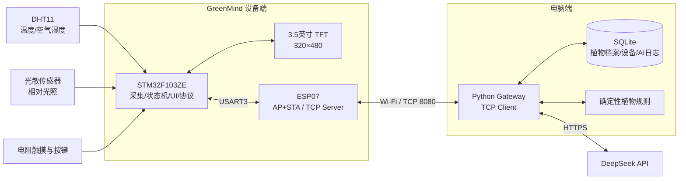
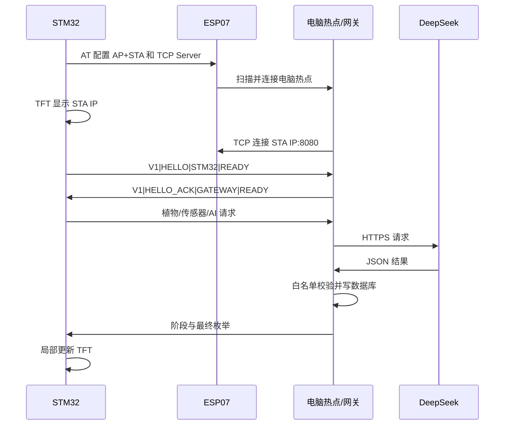
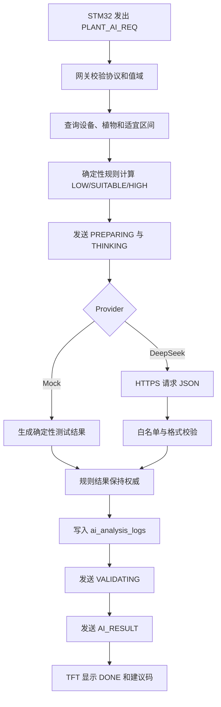

# GreenMind 当前阶段汇报与实验报告资料包

> 文档用途：交给负责课程汇报 PPT 和当前阶段实验报告的同学，作为统一、可核对的项目资料源。  
> 整理日期：2026-07-17  
> 项目阶段：智慧植物养护系统 MVP 已打通，植物数据库与选择闭环已加入，部分增强功能仍在集成阶段。

---

## 0. 使用本资料时必须注意

### 0.1 当前没有实机运行图片

截至本文整理时，项目目录中**没有归档可直接用于报告或 PPT 的实机运行照片、屏幕实拍图或演示视频**。

目录中的植物 PNG、像素图目录预览和协议日志属于软件资源或测试证据，**不能冒充实机运行照片**。制作汇报时可以先用架构图、流程图、数据表、代码结构和像素资源预览完成内容，但涉及“实物效果”的页面必须注明“待补拍”，不能写成已经有图片佐证。

建议在最终答辩前补拍的画面见本文“第 18 节：待补拍素材清单”。

### 0.2 本文采用的进度口径

为了避免把规划、代码准备和实机结果混为一谈，本文使用以下四种状态：

| 状态 | 含义 |
|---|---|
| 已实现并有实机闭环依据 | 已在开发板上观察到核心现象或完成过链路验证 |
| 已实现并通过软件测试 | 代码、数据库或协议测试已通过，但仍建议补充最终实机照片 |
| 已准备但未接入 | 文件或资源已经生成，还没有进入当前固件运行路径 |
| 尚未实现 | 仅属于后续设计，不应写入“已完成功能” |

### 0.3 安全与隐私

- 本文不记录 Wi-Fi 密码、DeepSeek API Key 等敏感内容。
- API Key 不应出现在 PPT、实验报告、截图、串口日志或 Git 仓库中。
- 固件本地密码配置和网关本地密钥文件应继续由 `.gitignore` 排除。
- 项目中的大模型只给出分析建议，不能直接控制水泵、PWM 或其他执行器。

---

## 1. 可直接用于报告的项目摘要

### 1.1 中文摘要

GreenMind 是一套基于 STM32F103ZE 的智慧植物养护原型系统。系统通过 DHT11 温湿度传感器和板载光敏传感器采集植物周围环境信息，使用 3.5 英寸 TFT 触摸屏完成本地数据显示、植物档案选择、网络状态查看和 AI 分析交互。ESP07 工作在 AP+STA 模式：一方面保留本地 AP，另一方面主动连接电脑热点；电脑端 Python 网关通过 TCP 与 STM32 通信，并负责访问 SQLite 植物数据库、执行确定性植物适配规则以及调用 DeepSeek。AI 返回结果必须经过后端白名单校验，STM32 只接收有限状态码和建议码，从而避免模型直接控制硬件。

当前系统已完成传感器采集、中文触摸 UI、Wi-Fi/TCP 通信、网关握手、DeepSeek 调用、植物数据库、六种植物选择和分析记录等主要闭环。项目还建立了 18 张植物状态像素资源，并完成了 RGB565 分包、序号和 CRC32 校验协议。默认绿萝的三种状态图已内置到固件，其余五种植物在使用时按需从数据库下载当前状态图片。完整 GB2312 12×12 字库、Unicode 映射、六页面中文标签和可触摸滚动的 AI 中文长文本对话框已经链接到固件；水泵和土壤湿度传感器尚未接入。

### 1.2 一句话定位

**GreenMind 将 STM32 本地感知、触摸交互、Wi-Fi 通信、植物数据库和大模型解释能力组合成一个安全、可扩展的智慧植物养护 MVP。**

### 1.3 项目关键词

STM32F103ZE、ESP07、TFT 触摸屏、DHT11、光敏传感器、TCP、Python 网关、SQLite、DeepSeek、植物个性化规则、像素 UI、CRC32。

---

## 2. 项目目标与边界

### 2.1 当前阶段目标

1. 实时采集温度、空气湿度和相对光照。
2. 在 TFT 上展示环境、网络、AI 和植物信息。
3. 通过触摸屏选择植物档案，并把选择结果保存到数据库。
4. 通过 Wi-Fi 和 TCP 将设备、植物及环境数据发送到电脑网关。
5. 由后端结合植物适宜区间进行确定性判断，再由 DeepSeek 生成易读解释。
6. 将经过验证的简短结果返回 STM32，显示 AI 处理阶段和最终建议。
7. 为后续增加 AI 中文长文本、更多植物、土壤湿度和水泵安全控制保留清晰接口。

### 2.2 当前不包含的功能

- 水泵实际接线、PWM 驱动和自动浇水；
- 土壤湿度传感器；
- AI 直接控制任何执行器；
- TFT 显示完整 AI 中文自然语言段落；
- TFT 显示完整的 AI 自然语言段落；
- 手机上的独立 App；
- 云端多用户后台和远程设备管理；
- 摄像头识别、病虫害图像诊断；
- 手机级动画、透明、模糊和高帧率界面。

### 2.3 重要科学口径

- 当前“湿度”来自 DHT11，是**空气相对湿度**，不是土壤湿度。
- 光敏值是开发板 ADC 转换后的 **0～100 相对量**，不是 lux。
- 植物图片的 `NORMAL / ATTENTION / DANGER` 是界面状态表达，不是病害视觉诊断。
- 浇水相关结果只能提示 `CHECK_SOIL` 等动作，不能仅凭空气湿度判断需要浇水。

---

## 3. 当前完成度总览

| 子系统 | 当前状态 | 可用于汇报的结论 |
|---|---|---|
| DHT11 温湿度采集 | 已实现并有实机依据 | 周期读取温度和空气湿度，并具有失败计数和重新初始化 |
| 光敏采集 | 已实现并有实机依据 | ADC3 采集并转换为 0～100 相对光照 |
| TFT 显示 | 已实现并有实机依据 | 320×480 竖屏、多页面、圆角卡片和局部刷新 |
| 电阻触摸 | 已实现并有实机依据 | 触摸释放触发，支持 EEPROM 校准保存和手动重新校准 |
| ESP07 STA | 已实现并有实机依据 | 主动搜索并连接电脑 2.4 GHz 热点 |
| ESP07 AP | 已实现 | 同时保留名为 `ESP07` 的本地 AP |
| TCP 双向通信 | 已实现并有实机依据 | ESP07/STM32 为 TCP Server，Python 为 TCP Client |
| 网关握手 | 已实现并有实机依据 | `HELLO / HELLO_ACK` 后进入 `GATEWAY READY` |
| DeepSeek 调用 | 已实现并有实机依据 | 已观察到真实 API 调用链路及 TFT `AI: DONE` |
| Mock AI | 已实现并通过测试 | 不消耗 API 额度，适合课堂演示前联调 |
| SQLite 植物数据库 | 已实现并通过测试 | 六种植物、环境区间、图像信息、设备选择和分析日志 |
| 植物选择 UI | 已实现 | 植物库、详情页、选择确认和数据库持久化 |
| 个性化植物规则 | 已实现并通过测试 | 同一环境针对不同植物可给出不同判断 |
| 植物像素资源 | 已实现并通过测试 | 6 种植物 × 3 种状态，共 18 张状态图 |
| 绿萝图片 | 已接入固件 | 三种状态图片内置 Flash，可离线显示 |
| 五种在线植物动态图片 | 已接入并通过软件测试 | 薄荷、多肉、仙人掌、蝴蝶兰和番茄共用数据库查询、分包、CRC32 和 TFT 显示链路 |
| 中文 GB2312 字库与 UI | 已实现并通过软件测试 | 147204 字节字库已链接，六页面标签和常用状态已中文化，待实机拍照验收 |
| 完整 AI 文本对话框 | 已实现并通过软件测试 | 中文长文本分片传输、CRC32、自动换行、触摸滚动和滚动条已完成，待实机验收 |
| 水泵 | 尚未接入 | SYSTEM 页明确显示 `PUMP: NOT CONNECTED` |

---

## 4. 总体系统架构

### 4.1 分层设计

GreenMind 不是让 STM32 直接访问大模型，而是使用“设备端 + 电脑网关 + 模型服务”的分层架构。



### 4.2 模块职责

| 模块 | 主要职责 |
|---|---|
| STM32 | 传感器采集、页面状态、触摸/按键、协议解析、错误状态、TFT 绘制 |
| ESP07 | 连接热点、保留本地 AP、提供 TCP Server、透传双向数据 |
| Python 网关 | TCP 重连、协议处理、数据库查询、规则计算、DeepSeek HTTPS 请求、结果校验和日志 |
| SQLite | 保存植物档案、适宜区间、像素资源索引、设备当前植物和 AI 分析历史 |
| DeepSeek | 对后端已确定的结果生成简短、植物相关的英文解释 |

### 4.3 为什么需要电脑网关

STM32F103 的资源和软件栈不适合直接承担完整 HTTPS、证书、JSON 和大模型错误处理。电脑网关可以：

- 隐藏和保护 API Key；
- 访问互联网；
- 承担 HTTPS 与 JSON；
- 保存 SQLite 数据；
- 对模型输出做白名单校验；
- 统一打印连接、协议、数据库和模型日志；
- 后续可以替换成手机、树莓派或云端服务，而不必重写传感器和 UI。

---

## 5. 硬件组成与接线信息

### 5.1 主要硬件

| 硬件 | 用途 |
|---|---|
| STM32F103ZE 开发板 | 主控制器 |
| 3.5 英寸 TFT，320×480 | 本地显示与触摸交互 |
| ESP07 Wi-Fi 模块 | AP+STA、TCP 通信 |
| DHT11 | 温度和空气湿度 |
| 板载光敏传感器 | 相对光照 |
| 电阻触摸层与校准 EEPROM | 点击和坐标校准 |
| 电脑 | 开启热点、运行 Python 网关、访问 DeepSeek |

### 5.2 当前代码使用的主要引脚

| 模块/信号 | STM32 引脚 | 说明 |
|---|---|---|
| DHT11 数据 | PG11 | 单总线读温湿度 |
| 光敏模拟输入 | PF8 / ADC3_CH6 | 转换为 0～100 相对光照 |
| ESP07 串口 TX | PB10 / USART3_TX | STM32 发送到 ESP07 |
| ESP07 串口 RX | PB11 / USART3_RX | STM32 接收 ESP07 |
| ESP07 使能相关 | PA4、PA15 | 当前代码置高 |
| KEY_UP | PA0 | 四个主页面循环切换 |
| KEY1 | PE3 | 发起 AI 分析 |
| TFT 背光 | PB0 | 当前保持开启 |
| WS2812 数据 | PE5 | 驱动代码存在，当前综合工程未启用 |
| 电阻触摸相关 | PB1、PB2、PF9、PF10、PF11 | 复用原触摸实验驱动 |
| 触摸校准 EEPROM | 板载 24Cxx 接口 | 保存校准系数和方向标记 |
| 水泵 PWM 预留 | PB5 / TIM3_CH2 | 当前未初始化、未接线 |

### 5.3 ESP07 模块与跳帽

最终正确连接口径如下：

1. ESP07 插入开发板的 P3 Wi-Fi 模块接口，注意 3.3 V 方向。
2. P10 使用两只跳帽，将 PB10/PB11 对应串口路由到 Wi-Fi 模块。
3. 运行 GreenMind 时断开占用同一 USART3 通道的蓝牙模块。
4. ESP07 使用 3.3 V 供电，不可直接接 5 V IO。
5. 电脑热点需支持 2.4 GHz，并允许电脑自身访问互联网。

### 5.4 水泵安全说明

水泵当前没有进入系统。以后接入时：

- 不允许 GPIO 直接给电机供电；
- 必须使用电机驱动、MOSFET 或合适驱动模块；
- 水泵使用匹配的独立电源，并与 STM32 共地；
- 上电默认关闭；
- 需要本地限时自动停止和紧急停止；
- AI 只给建议，启动动作必须由用户在本地确认。

---

## 6. Wi-Fi 与 TCP 网络结构

### 6.1 角色关系

| 对象 | 网络角色 |
|---|---|
| 电脑 | 2.4 GHz Wi-Fi 热点/AP，同时运行 Python 网关 |
| ESP07 | STA 连接电脑热点，同时保留自己的 AP |
| STM32 + ESP07 | TCP Server，监听端口 8080 |
| Python 网关 | TCP Client，主动连接 TFT 显示的 STA IP |

ESP07 使用 `CWMODE=3`，即 AP+STA 共存。保留 ESP07 自身 AP 不影响其作为 STA 接入电脑热点。真正用于 AI 闭环的是 ESP07 的 STA IP。

### 6.2 网络连接顺序



### 6.3 当前网络恢复设计

- ESP07 初始化步骤会在 TFT 和串口显示具体阶段。
- STA 任务采用非阻塞状态机，持续执行扫描、连接、查询 IP 和重试。
- Python 网关断线后每 3 秒重试连接。
- TCP 连接成功后仍需完成 `HELLO / HELLO_ACK`，才显示 `GATEWAY READY`。
- SYSTEM 页区分 Wi-Fi、STA IP、TCP 和 Gateway 状态，便于定位链路所在层级。

---

## 7. STM32 固件设计

### 7.1 开发环境与资源

- 芯片：STM32F103ZE
- Flash：512 KB
- SRAM：64 KB
- 固件工程：Keil MDK-ARM
- 编译器：ARM Compiler 5
- 主循环基本节拍：10 ms
- ESP07 和调试串口：115200 bit/s

### 7.2 主要软件模块

| 模块 | 作用 |
|---|---|
| `app_state` | 保存传感器、网络、植物、图片、AI 和页面统一状态 |
| `sensor_service` | DHT11、光敏的周期采集和异常恢复 |
| `key_service` | 按键去抖、页面切换、AI 请求 |
| `touch_service` | 触摸扫描、区域命中和释放触发 |
| `ui_service` | 页面绘制、圆角组件、局部刷新 |
| `protocol` | CRLF 帧流解析、消息校验、事件队列、请求编码 |
| `asset_service` | 图片分包接收、RGB565 解码、超时与 CRC32 校验 |
| `main.c` 网络任务 | ESP07 初始化、STA 扫描/加入、TCP/Gateway 状态机 |

### 7.3 任务周期

| 任务 | 当前周期/超时 |
|---|---|
| 主循环 | 10 ms |
| DHT11 采集 | 约 2 s |
| 光敏采集 | 约 1 s |
| UI 最小刷新间隔 | 约 100 ms |
| AI 请求超时 | 45 s |
| 图片传输超时 | 8 s，失败后可重试一次 |
| 网关断线重连 | 3 s |

### 7.4 传感器异常处理

- DHT11 失败时累计失败次数；
- 连续失败达到阈值后将数据标记为无效；
- 后续周期自动尝试重新初始化 DHT11；
- 屏幕用 `--` 或 `SENSOR ERROR` 表示无效数据；
- 光敏值和 DHT11 状态独立，不因单个模块失败而停止整个界面；
- 传感器无效时不应把无效值当作有效 AI 输入。

### 7.5 内存与稳定性设计

- 协议使用固定长度缓冲区，不进行动态内存分配；
- TCP 字节流可处理半包、粘包和多帧；
- 协议事件队列容量为 16；
- 发送队列容量为 3；
- 图片接收缓冲区固定为 48×48×2 字节；
- 大型协议对象使用静态存储；
- 启动栈已调整为 2 KB；
- 页面采用局部刷新，减少全屏刷新的闪烁和耗时。

---

## 8. TFT 界面与交互

### 8.1 UI 风格

当前界面为 320×480 竖屏中文 UI；品牌名、协议缩写、设备 ID 和底层错误码保留英文，界面采用：

- 绿色主题；
- 圆角卡片、圆角按钮和状态胶囊；
- 像素植物作为拟人化视觉中心；
- 固定底部导航；
- 局部重绘；
- 清晰的 GOOD、WARN、ERROR 状态颜色。

受 STM32F103 内存和无帧缓冲限制，界面不追求手机级透明、模糊或复杂动画，而强调稳定、可读和课程展示效果。

### 8.2 页面结构

系统包含 **4 个主页面 + 2 个植物子页面**。

#### HOME

- `GreenMind` 标题和 Wi-Fi 状态点；
- 当前植物名称和像素图；
- `ENVIRONMENT GOOD / NEEDS ATTENTION` 等概览；
- 温度、空气湿度、相对光照、AI Ready 状态；
- `MAIN ADVICE`；
- `DETAIL` 和 `ASK AI`；
- 点击植物卡片进入植物库。

#### DETAIL

- 温度、湿度、光照实时值；
- 三条圆角进度条；
- `LOW / NORMAL RANGE / HIGH / SENSOR ERROR`；
- 综合环境状态。

#### AI

- 当前植物和网关状态；
- 请求编号；
- `SENDING / PREPARING / THINKING / VALIDATING / DONE / ERROR / TIMEOUT`；
- 四段式进度条；
- `STATUS / ISSUE / WATER / ADVICE / ERROR`；
- `ANALYZE` 和 `RETRY`。

#### SYSTEM

- Wi-Fi 状态和热点名称；
- 设备 ID 和当前植物；
- STA IP；
- TCP 和 Gateway 状态；
- 最后错误；
- `PUMP: NOT CONNECTED`；
- `RETRY WIFI` 和 `CALIBRATE`。

#### PLANT LIBRARY

- 从 SQLite 获取的 6 个植物卡片；
- 显示植物名、`BUILTIN / ONLINE` 和 `CURRENT`；
- `BACK` 和 `REFRESH`。

#### PLANT PROFILE

- 植物名称、species ID、数据来源；
- 温度、空气湿度、相对光照适宜区间；
- `BACK` 和 `USE PLANT`；
- 保存时显示 `SAVING TO DEVICE`。

### 8.3 按键与触摸

| 输入 | 功能 |
|---|---|
| KEY_UP / PA0 | HOME、DETAIL、AI、SYSTEM 四主页面循环切换 |
| KEY1 / PE3 | 发起 AI 请求 |
| 底部导航 | 直接进入四个主页面 |
| HOME 植物卡片 | 进入植物库 |
| `USE PLANT` | 将选择保存到数据库并更新设备当前植物 |
| SYSTEM `CALIBRATE` | 手动重新校准触摸 |

触摸事件在松手时触发，可以减少按住时的重复点击。校准参数保存在 EEPROM 中，参数有效时上电无需每次重新校准。

### 8.4 局部刷新机制

- 切换页面时进行一次完整绘制；
- 同一页面内只在字段变化时重绘对应区域；
- 传感器值、Wi-Fi 点、AI 状态、建议和图片可以独立更新；
- UI 更新设置最小 100 ms 间隔，避免频繁重绘。

这项设计显著改善了状态变化时的整屏闪烁，但不等同于使用双缓冲的手机界面。

---

## 9. 环境数据与规则

### 9.1 光照分级

固件通用显示阈值为：

| 相对光照 | 固件显示级别 |
|---:|---|
| 0～29 | DARK |
| 30～69 | NORMAL |
| 70～100 | STRONG |

该分级用于通用显示。AI 个性化判断还会查询所选植物自己的适宜区间。

### 9.2 确定性植物适配规则

电脑网关先将每项环境数据与植物档案比较：

- 小于最小值：`LOW`
- 位于区间内：`SUITABLE`
- 大于最大值：`HIGH`

如果三项均适宜，结果为：

```text
STATUS=NORMAL
ISSUE=NONE
WATERING=NO_NEED
ADVICE=KEEP_CURRENT
```

出现偏差时，规则会根据温度、空气湿度、光照及偏差程度产生 `WARN` 或 `DANGER`，并给出有限建议码，例如：

- `TEMP_HIGH`
- `TEMP_LOW`
- `HUMIDITY_HIGH`
- `HUMIDITY_LOW`
- `LIGHT_HIGH`
- `LIGHT_LOW`
- `HOT_AND_BRIGHT`
- `MOVE_TO_SHADE`
- `INCREASE_LIGHT`
- `IMPROVE_VENTILATION`
- `CHECK_SOIL`
- `OBSERVE_PLANT`

### 9.3 个性化判断示例

环境相同：温度 30 ℃、空气湿度 45%、相对光照 80。

| 植物 | 规则结果 | 原因 |
|---|---|---|
| 绿萝 | `WARN / LIGHT_HIGH / MOVE_TO_SHADE` | 绿萝适宜光照上限为 60 |
| 仙人掌 | `NORMAL / NONE / KEEP_CURRENT` | 仙人掌适宜光照为 65～100 |

这个例子适合放入 PPT，能够直观说明“数据库和 species_id 不是只显示植物名称，而是真正改变了分析逻辑”。

---

## 10. SQLite 植物数据库

### 10.1 数据库定位

数据库只运行在电脑端，不占用 STM32 的 Flash 和 RAM。源数据与建表脚本可以重建一致的数据库：

```text
gateway/database/schema.sql
gateway/database/seed_plants.json
gateway/tools/init_database.py
```

运行数据库位于：

```text
gateway/data/greenmind.sqlite3
```

运行库是生成文件，不作为唯一数据源提交；当前本地数据库约 86 KB。

### 10.2 表结构

| 表 | 内容 |
|---|---|
| `schema_meta` | 数据库版本等元数据 |
| `plant_species` | 植物身份、中文名、英文名、学名、类别、难度和来源 |
| `plant_requirements` | 温度、空气湿度、光照范围和养护规则 |
| `plant_images` | 三种状态图路径、尺寸、格式、CRC32、SHA-256 和版本 |
| `devices` | 设备 ID、设备名称、当前植物、固件信息和最后在线时间 |
| `ai_analysis_logs` | 请求编号、设备、植物、传感器快照、AI/规则结果和提供方 |

数据库启用了外键、范围检查、唯一约束和查询索引。

### 10.3 当前六种植物

下表中的范围是课程项目初始种子数据；光照是 0～100 相对量，后续应结合实物校准。

| species_id | 植物 | 学名/示例 | 温度 ℃ | 空气湿度 % | 相对光照 | 难度 | 来源 |
|---|---|---|---:|---:|---:|---|---|
| `pothos` | 绿萝 / POTHOS | *Epipremnum aureum* | 18～30 | 40～75 | 25～60 | EASY | BUILTIN |
| `mint` | 薄荷 / MINT | *Mentha spicata* | 15～28 | 40～75 | 45～80 | EASY | ONLINE |
| `succulent` | 多肉 / SUCCULENT | *Echeveria spp.* | 15～30 | 30～60 | 55～90 | MEDIUM | ONLINE |
| `cactus` | 仙人掌 / CACTUS | *Opuntia microdasys* | 18～35 | 20～55 | 65～100 | EASY | ONLINE |
| `orchid` | 蝴蝶兰 / ORCHID | *Phalaenopsis spp.* | 18～28 | 50～75 | 30～60 | ADVANCED | ONLINE |
| `tomato` | 番茄 / TOMATO | *Solanum lycopersicum* | 18～30 | 40～70 | 60～100 | MEDIUM | ONLINE |

### 10.4 默认设备与持久化选择

- 默认设备 ID：`GM001`
- 数据库初始默认植物：`pothos`
- 用户在 TFT 选择新植物后，网关更新 `devices.current_species_id`
- STM32 只有收到 `PLANT_SELECTED` 后才确认切换
- 断线重连或网关重启后，可从数据库恢复当前植物
- 植物切换后清除旧植物的 AI 结果，避免错误复用

---

## 11. 植物像素图片系统

### 11.1 资源规模

- 6 种植物；
- 每种 3 个状态：`NORMAL / ATTENTION / DANGER`；
- 共 18 张状态图；
- 另有 1 张目录预览图；
- 逻辑像素图为 16×16，最近邻放大 3 倍后输出 48×48；
- 每张 RGB565 图片为 48×48×2 = 4608 字节；
- 格式为 `RGB565_BE`，即网络大端字节序。

### 11.2 资源文件

每张图同时提供：

- PNG：供人工预览、报告和资源检查；
- `.rgb565`：供 STM32 直接绘制；
- manifest：记录路径、尺寸、版本、CRC32 和 SHA-256。

资源清单：

```text
gateway/assets/plants/manifest.json
```

目录预览：

```text
gateway/assets/plants/catalog_preview.png
```

注意：目录预览是**资源设计图**，不是开发板运行照片。

### 11.3 当前固件接入范围

| 植物 | 当前图片策略 |
|---|---|
| 绿萝 | NORMAL、ATTENTION、DANGER 三张图内置固件，可离线显示 |
| 薄荷、多肉、仙人掌、蝴蝶兰、番茄 | 使用时从数据库按需下载当前状态图片，失败时显示通用占位图 |

因此汇报可以说“已经建立可扩展的 18 张资源库，并在软件中完成绿萝内置图和五种在线植物动态图两种路径”，但在逐一完成开发板验证前，不能说“五种在线植物都已经实机下载显示成功”。

### 11.4 动态图片协议

```text
STM32 -> Gateway: ASSET_REQ
Gateway -> STM32: ASSET_BEGIN
Gateway -> STM32: 多个 ASSET_CHUNK
Gateway -> STM32: ASSET_END
异常时: ASSET_ERROR
```

当前参数：

- 每个分包 40 个原始字节，转换为 80 个十六进制字符；
- 一张 4608 字节图片共 116 个分包；
- 网关分包间隔 20 ms；
- STM32 校验 transfer ID、顺序、尺寸、总字节数、分包数和 CRC32；
- 超时为 8 s；
- 失败后回退到占位图，不让 UI 因图片失败而停止。

### 11.5 图片状态与系统状态

- 环境正常：`NORMAL`
- 需要注意或 AI 分析中：`ATTENTION`
- 严重偏差或错误：`DANGER`

图片只是一种状态可视化，不代表通过摄像头识别了植物健康。

---

## 12. AI 分析闭环

### 12.1 请求内容

新版请求携带设备和植物身份：

```text
V1|PLANT_AI_REQ|REQ_ID|DEVICE_ID|SPECIES_ID|T|H|LIGHT|LIGHT_LEVEL
```

示例：

```text
V1|PLANT_AI_REQ|3|GM001|orchid|29|62|48|NORMAL
```

旧版 `AI_REQ` 仍兼容，并默认映射为 `GM001 / pothos`。

### 12.2 处理流程



### 12.3 TFT 可见阶段

```text
SENDING
PREPARING
THINKING
VALIDATING
DONE / ERROR / TIMEOUT
```

这里的 `THINKING` 是产品交互阶段提示，**不是展示模型私有推理过程**。

### 12.4 模型输出安全策略

DeepSeek 必须返回 JSON，字段被限制为：

- `status`
- `main_issue`
- `watering_advice`
- `advice_code`
- `suggestion_en`
- `dialog_zh`

后端确定性规则是权威结果。即使模型返回了不一致的状态码，网关也不会让模型覆盖规则。`suggestion_en` 用于电脑日志，`dialog_zh` 是受限长度的个性化中文台词；缺失、过长、包含不可显示字符或枚举不一致时，会回退为规则生成的确定性文案。

### 12.5 当前 TFT 实际收到什么

当前 STM32 先接收中文台词分包：

```text
V1|AI_TEXT_BEGIN|REQ_ID|BYTE_SIZE|CHUNK_COUNT|CRC32
V1|AI_TEXT_CHUNK|REQ_ID|SEQUENCE|HEX_PAYLOAD
V1|AI_TEXT_END|REQ_ID|CHUNK_COUNT|CRC32
```

随后仍接收安全枚举：

```text
V1|AI_RESULT|REQ_ID|STATUS|ISSUE|WATERING|ADVICE
```

例如：

```text
V1|AI_RESULT|10|WARN|LIGHT_HIGH|NO_NEED|MOVE_TO_SHADE
```

长文本使用固定缓冲区，并校验请求号、包序号、长度、UTF-8 和 CRC32。成功后
AI 页显示植物头像和“AI养护手记”多行卡片；失败时继续显示
`KEEP_CURRENT`、`MOVE_TO_SHADE` 等安全枚举。目前软件链路和真实 DeepSeek
输出已验证，TFT 最终观感尚待有硬件后实测。

### 12.6 Mock 与真实模型

| 模式 | 用途 | 是否消耗 API |
|---|---|---|
| `mock` | 离线联调、课堂演示前自检、规则和协议验证 | 否 |
| `deepseek` | 真实模型解释 | 是 |

当前默认模型配置为 `deepseek-v4-flash`，关闭模型 thinking 模式以降低延迟和成本。模型名称可通过命令行参数替换。

---

## 13. TCP 应用协议

### 13.1 基本格式

- ASCII 文本协议；
- 版本前缀：`V1`；
- 字段分隔符：`|`；
- 帧结束：`\r\n`；
- STM32 单帧上限：120 字节；
- request ID 范围：0～65535。

### 13.2 主要消息

| 功能 | 主要帧 |
|---|---|
| 网关握手 | `HELLO`、`HELLO_ACK` |
| 保活/诊断 | `PING`、`PONG` |
| AI | `PLANT_AI_REQ`、`ACK`、`AI_STAGE`、`AI_RESULT`、`ERROR` |
| 植物列表 | `PLANT_LIST_REQ`、`PLANT_LIST_BEGIN`、`PLANT_ITEM`、`PLANT_LIST_END` |
| 植物详情 | `PLANT_DETAIL_REQ`、`PLANT_DETAIL` |
| 植物选择 | `PLANT_SELECT`、`PLANT_SELECTED`、`PLANT_ERROR` |
| 图片 | `ASSET_REQ`、`ASSET_BEGIN`、`ASSET_CHUNK`、`ASSET_END`、`ASSET_ERROR` |

### 13.3 协议可靠性

- 接收端按字节流处理，支持 TCP 半包、粘包和一次收到多帧；
- 超长帧进入丢弃状态，直到下一个换行；
- 字段数量和值域都进行检查；
- AI 同一时刻只允许一个活动请求；
- 迟到但 request ID 不匹配的结果会被忽略；
- 图片使用 transfer ID、序号、总包数和 CRC32；
- 协议解析器只生成事件，不直接控制水泵或绘屏。

---

## 14. Python 网关

### 14.1 运行环境

- Windows 电脑；
- Python 3；
- 网关运行时只使用 Python 标准库；
- SQLite 由 Python 标准库直接访问；
- 植物图片生成工具额外使用 Pillow，但网关正常运行不依赖 Pillow。

### 14.2 启动方法

在 CMD 中：

```cmd
cd /d "D:\2026SecondHalf\Puzhong\普中开发板\GreenMind\gateway"
python .\run_gateway.py 192.168.137.169 --provider mock
```

真实 DeepSeek：

```cmd
python .\run_gateway.py 192.168.137.169
```

其中 `192.168.137.169` 只是示例，必须替换成 TFT SYSTEM 页当次显示的实际 STA IP。命令中不要保留 `<屏幕显示的STA-IP>` 这类尖括号占位符。

### 14.3 典型日志

以下内容可作为报告中的“通信结果示例”，但不是实机照片：

```text
[CONNECTION] connecting to 192.168.137.xxx:8080
[CONNECTION] TCP connected; waiting for STM32 HELLO
[RX] V1|HELLO|STM32|READY
[TX] V1|HELLO_ACK|GATEWAY|READY
[GATEWAY] READY
[RX] V1|PLANT_AI_REQ|2|GM001|pothos|26|65|62|NORMAL
[TX] V1|AI_STAGE|2|PREPARING
[TX] V1|AI_STAGE|2|THINKING
[TX] V1|AI_STAGE|2|VALIDATING
[ADVICE] Conditions fit the selected plant profile...
[TX] V1|AI_RESULT|2|NORMAL|NONE|NO_NEED|KEEP_CURRENT
```

### 14.4 错误码示例

| 错误码 | 含义 |
|---|---|
| `API_KEY_MISSING` | 找不到密钥 |
| `API_AUTH_ERROR` | 密钥认证失败 |
| `API_BALANCE_ERROR` | 额度不足 |
| `API_RATE_LIMIT` | 调用过快 |
| `MODEL_NETWORK_ERROR` | 电脑无法访问 API |
| `MODEL_TIMEOUT` | API 超时 |
| `MODEL_BAD_OUTPUT` | 模型 JSON 或枚举不合法 |
| `DEVICE_NOT_FOUND` | 数据库不存在该设备 |
| `PLANT_NOT_FOUND` | 数据库不存在该植物 |
| `DATABASE_ERROR` | SQLite 操作失败 |
| `ASSET_NOT_FOUND` | 无对应图片 |
| `ASSET_INVALID` | 图片尺寸、格式或 CRC 不一致 |

---

## 15. 当前验证证据

### 15.1 固件最新构建

最新 Keil 构建日志：

```text
Program Size: Code=51788 RO-data=211748 RW-data=264 ZI-data=16168
0 Error(s), 7 Warning(s)
Build Time Elapsed: 00:00:03
```

解释：

- 当前程序占用 Flash 约 `51788 + 211748 + 264 = 263800` 字节，约 257.6 KiB；
- 相对 512 KiB Flash，约占 50.3%；
- 当前 RAM 静态占用约 `264 + 16168 = 16432` 字节，约 16.0 KiB；
- 相对 64 KiB SRAM，约占 25.1%；
- 7 个警告来自原 TFT 驱动中的未使用局部变量，不是 GreenMind 新业务模块的编译错误；
- 以上 Flash 体积已经包含 147204 字节中文字库、29780 字节 Unicode→GB2312 映射和中文 UI 文案。

### 15.2 Python 自动化测试

当前测试命令：

```cmd
cd /d "D:\2026SecondHalf\Puzhong\普中开发板\GreenMind\gateway"
python -m unittest discover -s .\tests -v
```

最新结果：

```text
Ran 38 tests
OK
```

测试覆盖：

- TCP 帧编码、解码和非法输入；
- 新旧 AI 请求；
- 植物规则；
- SQLite 初始化、查询、选择和日志；
- Mock 网关处理；
- 植物列表、详情和选择协议；
- 图片 manifest、固件内置图一致性；
- 五种在线植物三种状态图片的数据库可查询性与固件通用下载策略；
- RGB565 资源分包、包数和 CRC32；
- AI 中文正文分包重组、序号、UTF-8 和 CRC32；
- 关闭长文本后的旧枚举协议回退；
- TCP 空闲心跳、`PONG` 接收和失联超时重连；
- 图片不存在和植物不存在等异常。

### 15.3 已有实机现象依据

项目开发过程中已经观察到：

- DHT11 和光敏数据可在 TFT 上显示；
- 触摸方向修正后页面交互正常；
- ESP07 可连接电脑热点；
- TFT 可显示 STA IP、TCP 和 Gateway 状态；
- Python 能连接设备的 8080 端口；
- `HELLO / HELLO_ACK` 握手成功；
- AI 页面可经历 PREPARING、THINKING、VALIDATING；
- 真实 DeepSeek 链路完成后 TFT 显示 `AI: DONE`；
- 页面局部刷新后，状态变化时的整屏闪烁明显减少。

这些现象目前缺少统一归档的实机照片，因此最终报告仍应补拍验证。

### 15.4 建议补做的最终验收

| 编号 | 验收内容 | 预期结果 |
|---|---|---|
| T01 | 冷启动 | HOME 正常出现，水泵保持未连接 |
| T02 | 传感器 | 温湿度约 2 s 更新，光照约 1 s 更新 |
| T03 | 触摸 | 六个页面可进入，点击只触发一次 |
| T04 | Wi-Fi | ESP07 加入电脑热点，SYSTEM 显示 STA IP |
| T05 | Gateway | Python 连接后 `TCP: CONNECTED`、`GATEWAY: READY` |
| T06 | Mock AI | AI 从 SENDING 到 DONE，不消耗 API |
| T07 | DeepSeek | 出现真实模型日志，TFT 最终 DONE |
| T08 | 植物选择 | 切换植物、数据库保存、重连后仍保持 |
| T09 | 个性化 | 相同环境下绿萝与仙人掌结果不同 |
| T10 | 动态图片 | 仙人掌图完成 116 包和 CRC 校验并显示 |
| T11 | 断网/复位恢复 | 网关退出后可重连；只重启 STM32 而不重启网关时也能恢复 READY |
| T12 | 传感器异常 | 无效数据显示为 `--/ERROR`，UI 不死机 |

---

## 16. 复现实验步骤

### 16.1 软件准备

1. 使用 Keil 打开：

   ```text
   GreenMind/firmware/GreenMind.uvprojx
   ```

2. 确认本地 Wi-Fi 密码配置存在，但不要提交到 Git。
3. 编译并烧录。
4. 电脑开启 2.4 GHz 热点，并保持互联网连接。

### 16.2 数据库和资源准备

首次或需要重建时：

```cmd
cd /d "D:\2026SecondHalf\Puzhong\普中开发板\GreenMind\gateway"
python .\tools\generate_plant_assets.py
python .\tools\init_database.py --reset
python -m unittest discover -s .\tests -v
```

`--reset` 会重建数据库，可能把设备当前植物恢复为默认绿萝。普通演示不需要每次执行。

### 16.3 Mock 闭环

1. 上电并进入 SYSTEM 页；
2. 等待 `WIFI: CONNECTED`；
3. 记录屏幕上的 STA IP；
4. 运行：

   ```cmd
   python .\run_gateway.py 实际数字IP --provider mock
   ```

5. 等待 `TCP: CONNECTED` 和 `GATEWAY: READY`；
6. 点击 `ASK AI` 或按 KEY1；
7. 观察 AI 阶段最终进入 DONE。

### 16.4 真实 DeepSeek 闭环

1. 确认 API Key 仅存在本地安全位置或环境变量；
2. 确认电脑能访问互联网；
3. 运行：

   ```cmd
   python .\run_gateway.py 实际数字IP
   ```

4. 发起 AI；
5. 同时记录 TFT 阶段和电脑端 `[MODEL] / [ADVICE] / [TX]` 日志；
6. 不在报告截图中暴露密钥或密码。

### 16.5 植物选择

1. HOME 点击植物卡片；
2. PLANT LIBRARY 中点击目标植物；
3. PROFILE 查看适宜区间；
4. 点击 `USE PLANT`；
5. 等待 `PLANT_SELECTED`；
6. 返回 HOME，确认名称、建议状态和图片策略变化；
7. 重启网关再次读取列表，确认数据库持久化。

---

## 17. 当前局限与下一阶段

### 17.1 已接入的中文字体与当前边界

已生成：

```text
firmware/Assets/fonts/greenmind_gb2312_12x12.bin
```

参数：

- 12×12；
- 1 bpp；
- 按 GB2312 双字节固定槽位寻址；
- 文件大小 147204 字节；
- 已分配字形 7445 个，其中汉字 6763 个；
- 缺失字形 0；
- 主字体为 Fusion Pixel Font；
- 177 个符号由 Noto Sans CJK SC 补齐；
- 许可证均为 SIL OFL 1.1。

当前状态：

- 字库通过汇编 `INCBIN` 进入只读 Flash；
- 29780 字节完整 Unicode→GB2312 映射已链接；
- 字体服务支持 UTF-8 解码、二分查找和 12/24 像素绘制；
- 134 条中文 UI 文案通过生成器转为 ARMCC 安全的 UTF-8 字节数组；
- 六个页面的标题、按钮、植物名、网络状态和 AI 枚举已中文化；
- `APP_UI_ENABLE_CHINESE=0` 可以快速回退英文 UI；
- 当前完整构建约占 50.3% Flash、25.1% RAM。

AI 中文长文本分包、自动换行和 Galgame 风格卡片已经实现，尚待实机验收。

### 17.2 个性化 AI 对话框

该功能已经按以下方案完成：

1. 增加独立文本消息，而不破坏当前 `AI_RESULT`：

   ```text
   V1|AI_TEXT_BEGIN|REQ_ID|BYTE_SIZE|CHUNK_COUNT|CRC32
   V1|AI_TEXT_CHUNK|REQ_ID|SEQUENCE|HEX_PAYLOAD
   V1|AI_TEXT_END|REQ_ID|CHUNK_COUNT|CRC32
   ```

2. 每包 32 个 UTF-8 原始字节，正文最多 768 字节；
3. DeepSeek 返回受限中文文本，复用 UTF-8 和 GB2312 字体服务；
4. 使用 Galgame 风格“AI养护手记”卡片自动换行，并支持触摸上下滚动；
5. 文本失败时仍保留现有枚举结果，不影响核心闭环。

### 17.3 植物图片全面动态化

当前动态链路以仙人掌作为验证对象。后续应：

- 根据当前植物和环境状态自动请求对应图片；
- 增加小型 Flash/EEPROM 缓存或版本缓存；
- 避免每次页面刷新重复下载；
- 在全部植物实机显示后补充照片和传输耗时数据。

### 17.4 土壤湿度与水泵

推荐顺序：

1. 先接入土壤湿度传感器；
2. 单独验证水泵驱动、电源和共地；
3. 实现本地手动启动、固定时长停止和紧急停止；
4. Wi-Fi 或 AI 失败时也必须能停止；
5. AI 只显示建议，用户确认后才能执行。

### 17.5 其他可扩展方向

- 设备发现，减少手工输入 STA IP；
- 多设备 ID 和设备管理；
- 历史曲线和趋势分析；
- 植物规则版本管理；
- 网关 Web 管理页；
- 手机 App 或小程序；
- 蜂鸣器和彩灯状态提示；
- 传感器标定与 lux 转换；
- 更完整的硬件故障自动恢复。

---

## 18. 待补拍素材清单

建议一次演示中完成以下照片或视频。每张图应避免拍到 Wi-Fi 密码和 API Key。

| 素材编号 | 建议内容 | 可支持的 PPT/报告结论 |
|---|---|---|
| P01 | 开发板、TFT、ESP07、传感器整体接线 | 硬件平台与系统组成 |
| P02 | HOME 页，显示绿萝、温湿度、光照和 Wi-Fi 点 | 主页和拟人化植物 UI |
| P03 | DETAIL 页实时进度条 | 环境数据采集 |
| P04 | SYSTEM 页显示 STA IP、TCP、Gateway Ready | Wi-Fi/TCP 链路 |
| P05 | AI 页 `THINKING` | 模型调用过程可视化 |
| P06 | AI 页 `DONE` 和枚举建议 | AI 闭环结果 |
| P07 | PLANT LIBRARY 六种植物 | SQLite 驱动的植物库 |
| P08 | PLANT PROFILE 区间和 `USE PLANT` | 植物个性化档案 |
| P09 | 切换到仙人掌后的 HOME | 动态资源或植物切换 |
| P10 | 电脑网关真实 DeepSeek 日志 | PC 网关和模型调用 |
| P11 | SQLite 查询终端或数据库浏览器 | 数据库内容与持久化 |
| P12 | 网关关闭/恢复前后的 SYSTEM 页 | 异常检测和恢复 |
| V01 | 从开机到 AI DONE 的完整短视频 | 现场答辩主演示 |

在照片补齐之前，PPT 中可以使用以下占位方式：

```text
[待补拍：HOME 页实机运行图]
[待补拍：AI DONE 实机图]
```

不要使用软件生成的示意图并标注为“实机效果”。

---

## 19. PPT 推荐结构

建议制作 12～15 页，控制在 8～12 分钟。

### 第 1 页：封面

- GreenMind 智慧植物养护系统
- STM32 + Wi-Fi + SQLite + DeepSeek
- 课程、班级、组员、日期

### 第 2 页：背景与问题

- 传统环境监测只显示数字；
- 不同植物的适宜环境不同；
- MCU 不适合直接保存大量档案和调用 HTTPS 大模型；
- 目标是建立“感知—理解—展示”的闭环。

### 第 3 页：项目目标与边界

- 环境采集；
- 触摸交互；
- Wi-Fi 全双工；
- 植物个性化 AI；
- 强调空气湿度不等于土壤湿度；
- 当前不控制水泵。

### 第 4 页：总体架构

使用本文第 4 节 Mermaid 架构图，讲清：

- STM32；
- ESP07；
- 电脑网关；
- SQLite；
- DeepSeek。

### 第 5 页：硬件与接线

- 硬件清单；
- 关键引脚表；
- ESP07 P3/P10；
- 补入 P01 实机图。

### 第 6 页：设备端软件设计

- `app_state`；
- sensor/key/touch/UI/protocol/asset service；
- 10 ms 主循环；
- 非阻塞状态机和固定缓冲区。

### 第 7 页：UI 与交互

- 4 个主页面 + 2 个植物子页面；
- 圆角卡片和像素植物；
- 局部刷新；
- 后续补入 P02、P03、P07、P08。

### 第 8 页：Wi-Fi 与 TCP

- 电脑是热点/AP；
- ESP07 是 STA，同时保留自身 AP；
- STM32/ESP07 是 TCP Server；
- Python 是 TCP Client；
- 展示握手时序。

### 第 9 页：植物数据库

- 六种植物表；
- 六张表的用途；
- 设备 ID 和 species_id；
- 选择结果持久化。

### 第 10 页：个性化规则与 AI

- 先规则、后模型；
- 模型只解释，不改规则；
- 绿萝和仙人掌在同一环境下结果不同；
- DeepSeek 只返回受限 JSON。

### 第 11 页：像素资源链路

- 6×3=18 张；
- PNG + RGB565；
- 40 字节分包、116 包、CRC32；
- 绿萝内置、五种在线植物按需动态下载。

### 第 12 页：实验结果

- 固件 0 error；
- Python 38 tests OK；
- Wi-Fi/TCP/Gateway/AI DONE；
- 当前没有归档实机图，明确标注待补。

### 第 13 页：可靠性与安全

- 半包/粘包；
- request ID；
- 超时重试；
- 传感器自动恢复；
- 模型白名单；
- API Key 不下发；
- 水泵禁止由 AI 控制。

### 第 14 页：不足与下一步

- AI 中文长文本对话框；
- AI 文本对话框；
- 全植物动态图片；
- 土壤湿度；
- 水泵本地安全控制；
- 历史趋势。

### 第 15 页：总结

强调当前已经完成：

> STM32 感知、触摸交互、Wi-Fi/TCP、电脑网关、SQLite 植物档案、确定性规则和 DeepSeek 解释的最小闭环。

---

## 20. 实验报告推荐结构

### 20.1 报告题目

《基于 STM32、ESP07 与大模型网关的智慧植物养护系统设计》

### 20.2 第一章：实验目的

- 掌握 STM32 多传感器数据采集；
- 掌握 TFT 和电阻触摸交互；
- 掌握 ESP07 AT 指令和 TCP 通信；
- 掌握 MCU 与电脑端协议设计；
- 掌握 SQLite 植物数据建模；
- 掌握大模型调用、结构化输出和安全校验。

### 20.3 第二章：总体方案

- 系统需求；
- 分层架构；
- 网络拓扑；
- 安全边界；
- 选择电脑网关的原因。

### 20.4 第三章：硬件设计

- STM32F103ZE；
- DHT11；
- 光敏 ADC；
- TFT 和触摸；
- ESP07；
- 引脚表和接线图；
- 电源与串口复用注意事项。

### 20.5 第四章：设备端软件设计

- 主循环；
- 统一状态结构；
- 传感器任务；
- Wi-Fi STA 状态机；
- TCP 与协议事件；
- 触摸命中；
- UI 局部刷新；
- 图片接收和 CRC32。

### 20.6 第五章：电脑网关和数据库

- Python 网关结构；
- SQLite 六张表；
- 种子数据；
- 设备和植物持久化；
- 自动重连；
- 日志和异常码。

### 20.7 第六章：植物规则与大模型

- 适宜区间比较；
- 个性化示例；
- Mock 和 DeepSeek；
- JSON 白名单；
- 模型不能覆盖规则；
- 模型不能控制水泵。

### 20.8 第七章：实验过程

按本文第 16 节记录：

1. 固件编译烧录；
2. 传感器显示；
3. 电脑热点；
4. STA IP；
5. Mock 闭环；
6. DeepSeek 闭环；
7. 植物选择；
8. 图片协议；
9. 异常恢复。

### 20.9 第八章：结果与分析

建议包含：

- 固件构建数据；
- 38 项测试结果；
- 典型协议日志；
- 各页面实拍；
- 植物个性化对比；
- 图片分包与 CRC32；
- 网络断开和恢复；
- 当前资源占用。

### 20.10 第九章：不足与改进

如实写明：

- 尚无土壤湿度；
- 尚无水泵；
- TFT 已支持中文标签，但暂不显示完整 AI 中文段落；
- 完整 AI 文本还在 PC；
- 动态图片尚未覆盖所有植物；
- 光照没有标定为 lux；
- 当前没有归档运行照片，需在最终验收补齐。

### 20.11 第十章：结论

使用本文末尾的“可直接引用结论”，并结合最终实拍和数据修改。

---

## 21. 报告中建议填写的数据表

### 21.1 环境采集记录

| 序号 | 温度/℃ | 空气湿度/% | 相对光照 | 固件光照级别 | 当前植物 | AI 状态 | 主要问题 | 建议码 |
|---:|---:|---:|---:|---|---|---|---|---|
| 1 | 待测 | 待测 | 待测 | 待测 | POTHOS | 待测 | 待测 | 待测 |
| 2 | 待测 | 待测 | 待测 | 待测 | CACTUS | 待测 | 待测 | 待测 |
| 3 | 待测 | 待测 | 待测 | 待测 | ORCHID | 待测 | 待测 | 待测 |

### 21.2 AI 调用记录

| 请求 ID | Provider | 植物 | T/H/L | 响应时间/s | 最终状态 | 网关错误 | TFT 结果 |
|---:|---|---|---|---:|---|---|---|
| 待测 | mock | 待测 | 待测 | 待测 | 待测 | NONE | DONE |
| 待测 | deepseek | 待测 | 待测 | 待测 | 待测 | NONE | DONE |

### 21.3 异常恢复记录

| 异常 | TFT 表现 | 网关日志 | 是否自动恢复 | 恢复时间 |
|---|---|---|---|---|
| 关闭网关 | GATEWAY OFFLINE | connection closed | 待测 | 待测 |
| 重新启动网关 | GATEWAY READY | HELLO_ACK | 待测 | 待测 |
| 热点暂时关闭 | WIFI 非 CONNECTED | TCP retry | 待测 | 待测 |
| DHT11 读取失败 | TEMP/HUMIDITY -- | 状态日志 DHT=ERROR | 待测 | 待测 |

---

## 22. 可直接引用的创新点

1. **规则与大模型分工**：确定性规则负责最终状态，大模型只负责自然语言解释，减少模型幻觉对硬件系统的影响。
2. **设备、植物和环境联合分析**：协议携带 `device_id` 和 `species_id`，同一环境可以根据植物档案得到不同结论。
3. **资源受限设备上的产品化 UI**：在 STM32F103 上实现圆角卡片、像素植物、多页面触摸和局部刷新。
4. **数据库驱动的植物库**：植物信息不硬编码在 STM32 中，SQLite 可继续增加植物、图片和规则。
5. **内置与在线图片并存**：默认绿萝离线可用，其他资源可通过受校验的分包协议传输。
6. **可观测的端到端链路**：TFT 显示 Wi-Fi、TCP、Gateway 和 AI 阶段，电脑日志显示协议、数据库和模型过程。
7. **执行器安全边界**：模型协议不存在水泵启动命令，为以后接入水泵保留本地确认和限时停止空间。

---

## 23. 可直接引用的结论

本阶段完成了 GreenMind 智慧植物养护系统的核心 MVP。STM32F103ZE 能够稳定采集温度、空气湿度和相对光照，通过 3.5 英寸触摸屏完成多页面显示与植物选择，并经 ESP07 与电脑端 Python 网关进行双向 TCP 通信。电脑网关可查询 SQLite 植物档案，执行确定性环境适配规则，调用 Mock 或 DeepSeek 生成植物相关解释，再将经过白名单校验的结果返回设备。系统已经具备设备 ID、植物 ID、AI 请求状态、异常码、数据库日志、局部刷新和图片 CRC32 校验等可扩展基础。

当前系统仍属于课程项目原型：空气湿度不能替代土壤湿度，水泵尚未接入，完整 AI 中文文本尚未进入 TFT 运行路径，部分植物图片的动态加载仍需完成最终实机验收。后续将在保持“AI 只建议、不直接执行”的安全原则下，继续完善中文长文本对话框、全植物资源、土壤湿度和本地水泵安全控制。

---

## 24. 关键文件索引

### 24.1 固件

| 文件/目录 | 内容 |
|---|---|
| `firmware/GreenMind.uvprojx` | Keil 工程 |
| `firmware/User/main.c` | 主循环、Wi-Fi、TCP、Gateway 和业务调度 |
| `firmware/APP/agriculture/app_state.*` | 统一应用状态 |
| `firmware/APP/agriculture/app_config.h` | 设备、网络和周期配置 |
| `firmware/APP/agriculture/sensor_service.*` | DHT11、光敏 |
| `firmware/APP/agriculture/key_service.*` | 按键 |
| `firmware/APP/agriculture/touch_service.*` | 触摸命中 |
| `firmware/APP/agriculture/ui_service.*` | 六页面 UI 和局部刷新 |
| `firmware/APP/agriculture/protocol.*` | TCP 应用协议 |
| `firmware/APP/agriculture/asset_service.*` | 动态图片接收 |
| `firmware/APP/agriculture/plant_assets_builtin.*` | 绿萝内置图片 |
| `firmware/Assets/fonts/` | 已接入的中文字库和 Unicode→GB2312 映射 |
| `firmware/Obj/GreenMind.build_log.htm` | 最新构建日志 |

### 24.2 电脑网关

| 文件/目录 | 内容 |
|---|---|
| `gateway/run_gateway.py` | 网关入口 |
| `gateway/agri_gateway/client.py` | TCP、植物、图片和 AI 处理 |
| `gateway/agri_gateway/protocol.py` | Python 协议编解码 |
| `gateway/agri_gateway/providers.py` | Mock/DeepSeek 与输出校验 |
| `gateway/agri_gateway/plant_rules.py` | 确定性植物规则 |
| `gateway/agri_gateway/database.py` | SQLite 初始化 |
| `gateway/agri_gateway/plant_repository.py` | 数据查询和写入 |
| `gateway/database/schema.sql` | 表结构 |
| `gateway/database/seed_plants.json` | 六种植物种子数据 |
| `gateway/assets/plants/` | PNG、RGB565 和 manifest |
| `gateway/tests/` | 38 项自动化测试 |
| `gateway/tools/` | 数据库、图片和固件资源生成工具 |

### 24.3 中文字库工具

| 文件/目录 | 内容 |
|---|---|
| `tools/fonts/generate_gb2312_font.py` | GB2312 12×12 字库生成 |
| `tools/fonts/README.md` | 字库来源、格式和许可证说明 |
| `tools/fonts/OFL.txt` | Fusion Pixel Font 许可证 |
| `tools/fonts/OFL-Noto.txt` | Noto Sans CJK SC 许可证 |

---

## 25. 答辩时容易说错的内容

| 不准确说法 | 建议改为 |
|---|---|
| “湿度低，所以系统判断土壤缺水” | “DHT11 测的是空气湿度，系统只建议另行检查土壤” |
| “AI 控制水泵” | “AI 只给建议；当前水泵未接入，未来也必须由本地安全逻辑控制” |
| “所有植物图片都从数据库下载到 STM32” | “绿萝三张图内置；其余五种植物已接入按需下载，但仍待逐一实机验收” |
| “TFT 已经实机显示所有 AI 中文回答” | “AI 中文长文本的软件链路已完成，实机排版和稳定性仍待验收” |
| “TFT 会显示任意长度的 DeepSeek 回答” | “TFT 最多接收 768 个 UTF-8 字节，并经过字符、顺序和 CRC32 校验；超出一屏可触摸滚动” |
| “ESP07 是电脑热点” | “电脑是热点；ESP07 作为 STA 加入热点，同时保留自己的 AP” |
| “Python 是服务器” | “当前 STM32/ESP07 是 TCP Server，Python 网关是 TCP Client” |
| “光照是 62 lux” | “当前是 0～100 的相对光照值，不是 lux” |
| “项目已有完整实机图片” | “当前没有归档运行图片，最终答辩前需要补拍” |

---

## 26. 最简口头介绍稿

我们的项目叫 GreenMind，是一个基于 STM32F103 的智慧植物养护系统。设备端采集温度、空气湿度和相对光照，在 3.5 英寸中文触摸界面上提供主页、环境详情、AI、系统状态以及植物选择页面。ESP07 同时工作在 AP 和 STA 模式，通过电脑热点建立 TCP 通信。电脑端 Python 网关访问 SQLite 植物数据库，先根据所选植物的适宜温湿度和光照范围做确定性判断，再调用 DeepSeek 生成结合植物特点、当前环境和趣味知识的中文养护台词。模型不能改变规则结果，也不能控制水泵。安全枚举和中文台词通过独立协议下发，STM32 校验长度、顺序、UTF-8 和 CRC32 后，在“AI养护手记”对话框显示。当前软件链路已经完成，下一步是实机验收中文长文本、完善所有植物图片动态加载，并在增加土壤湿度后实现安全的本地水泵控制。
